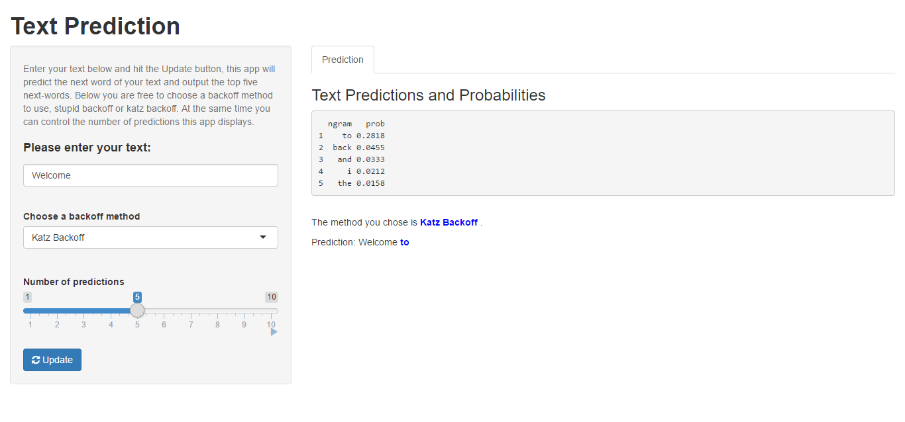

# Text Prediction Project Based on R

## Repo Description

This Repo contains:

- Milestone Report (An intermediate R markdown report that describes in plain language, plots, and code my exploratory analysis of the course data set.)
- Backoff Methods (my algorithms)
- Text Prediction App Presentation (A 5 slide deck created with R presentations pitching my algorithm and app to potential customers.)
- Text Prediction App (A Shiny app that takes as input a phrase (multiple words), one clicks submit, and it predicts the next word.)

## Project Description

This project starts from analyzing a large corpus of text documents 
to discover the structure in the data and how words are put together. 
It covers cleaning and 
analyzing text data, then building and sampling from a predictive text model. 
Finally, use the knowledge gained in data products to build a 
predictive text product. 

## App Demo

## Useful Links

- App can be found here [Shiny App](https://teenbatmango.shinyapps.io/textprediction/)
- Data set can be found here [Capstone Dataset](https://d396qusza40orc.cloudfront.net/dsscapstone/dataset/Coursera-SwiftKey.zip)
- Project website [JHU Capstone Project](https://www.coursera.org/learn/data-science-project/home/week/1)
- Contact address: wangchengmingbbs@126.com